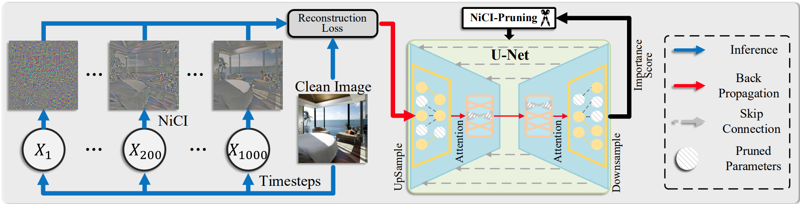
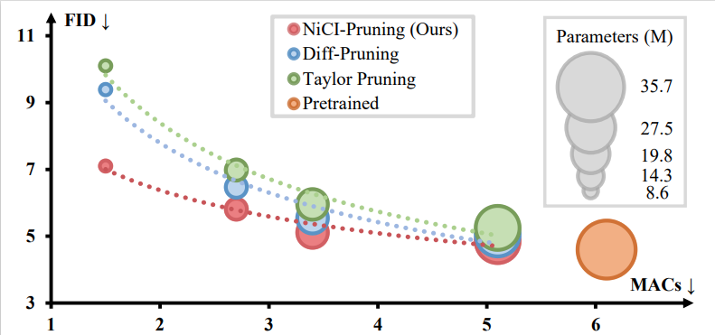

# Diffusion Model Pruning Guided by Reconstruction of Noise in Clean Image
<div align="center">
</img>
</div>

## Introduction


This work presents *NiCI-Pruning*, an efficient structrual pruning method for diffusion models. Our empirical assessment highlights two primary features:
1) ``Efficiency``: It enables approximately a 44% reduction in FLOPs and Parameters with acceptable image quality decrease; 
2) ``Consistency``: The pruned diffusion models inherently preserve generative behavior congruent with the pre-trained ones.

<div align="center">
</img>
</div>

### Supported Methods
- [x] Magnitude Pruning
- [x] Taylor Pruning
- [x] Diff-Pruning
- [x] NiCI-Pruning (Ours)
 

### TODO List
- [ ] Support more diffusion models from Diffusers

# Model Zoo

We provide pretrained models on Diffusers and models pruned with our NiCI-Pruning.


| Name | FID | MACs (G) | Param (M)   | url |
| --- | --- | --- | --- | --- |
| CIFAR-32x32 | 4.49 | 6.1 | 35.7 |[model](https://github.com/VainF/Diff-Pruning/releases/download/v0.0.1/ddpm_ema_cifar10.zip) |
| NiCI (16%) | 4.85 | 5.1 | 27.5 | [model](https://drive.google.com/drive/folders/1Hv9VE-DMF_r_Ql9gZDBF1gMsCW4cNuFl?usp=sharing) |
| NiCI (44%) | 5.11 | 3.4 | 19.8 | [model](https://drive.google.com/drive/folders/1J9HL04-TNmOwZ5D00-9HlIjIFbTpuNoY?usp=sharing) |
| NiCI (56%) | 5.91 | 2.7 | 14.3 | [model](https://drive.google.com/drive/folders/1vLKqJYcpJ4Swz9tiuL24BLfEMQmxAlQ8?usp=sharing) |
| NiCI (70%) | 6.75 | 1.5 | 8.6 | [model](https://drive.google.com/drive/folders/1HZdkOHFbykSBdRQcJQ6tRJk1ZP2QkXaD?usp=sharing) |
| LSUN-Bedroom| 10.63 | 248.7 | 113.7 |[model](https://huggingface.co/google/ddpm-bedroom-256) |
| NiCI Bedroom (44%)| 19.93 | 138.8 | 63.2 |[model](https://drive.google.com/drive/folders/10vmxaKkDDr0_x463oUkpYF5ILtEe2hLg?usp=sharing) |
| LSUN-Church | 13.75 | 248.7 | 113.7 |[model](https://huggingface.co/google/ddpm-church-256) |
| NiCI Church (44%)| 15.96 | 138.8 | 63.2 |[model](https://drive.google.com/drive/folders/1Kvjx3SGLifOBypagAqkvbywc4BIk5PBC?usp=sharing) |


### 0. Requirements, Data and Pretrained Model

* Requirements
```bash
pip install -r requirements.txt
```
 
* Data
  
Download and extract CIFAR-10 images to *data/cifar10_images* for training and evaluation.
```bash
python tools/extract_cifar10.py --output data
```
* Pretrained Models
  
The following script will download an official DDPM model and convert it to the format of Huggingface Diffusers. You can find the converted model at *pretrained/ddpm_ema_cifar10*. It is an EMA version of [google/ddpm-cifar10-32](https://huggingface.co/google/ddpm-cifar10-32)
```bash
bash tools/convert_cifar10_ddpm_ema.sh
```

(Optional) You can also download a pre-converted model using wget
```bash
wget https://github.com/VainF/Diff-Pruning/releases/download/v0.0.1/ddpm_ema_cifar10.zip
```

### 1. Pruning
Create a pruned model at *run/pruned/ddpm_cifar10_pruned* 
```
python ddpm_prune.py \
--dataset cifar10 \
--model_path [path/to/pretrained-model] \
--save_path run/pruned/ddpm_cifar10_pruned \
--pruning_ratio 0.3 \
--batch_size 128 \
--pruner c2c \
```

### 2. Finetuning (Post-Training)
Finetune the model and save it at *run/finetuned/ddpm_cifar10_pruned_post_training*
``` 
python ddpm_train.py \
  --dataset cifar10 \
  --model_path run/pruned/ddpm_cifar10_pruned \
  --pruned_model_ckpt run/pruned/ddpm_cifar10_pruned/pruned/unet_pruned.pth \
  --teacher_path [path/to/pretrained-model] --alpha=50 --tau=1 \
  --resolution 32 \
  --output_dir run/finetuned/ddpm_cifar10_pruned_post_training \
  --train_batch_size=128 \
  --num_iters=100000 \
  --learning_rate=2e-4 \
  --use_ema
```

### 3. Sampling
**Pruned:** Sample and save images to *run/sample/ddpm_cifar10_pruned*
```
python ddpm_sample.py \
--output_dir run/sample/ddpm_cifar10_pruned \
--batch_size 1024 \
--total_samples 50000 \
--pruned_model_ckpt run/finetuned/ddpm_cifar10_pruned_post_training/pruned/unet_ema_pruned.pth \
--model_path run/finetuned/ddpm_cifar10_pruned_post_training \
--skip_type uniform \

```

**Pretrained:** Sample and save images to *run/sample/ddpm_cifar10_pretrained*
```bash
python ddpm_sample.py \
--output_dir run/sample/ddpm_cifar10_pretrained \
--batch_size 1024 \
--model_path [path/to/pretrained-model] \
```

### 4. FID Score
This script was modified from https://github.com/mseitzer/pytorch-fid. 

```bash
# pre-compute the stats of CIFAR-10 dataset
python fid_score.py --save-stats data/cifar10_images run/fid_stats_cifar10.npz --device cuda:0 --batch-size 256
```

```bash
# Compute the FID score of sampled images
python fid_score.py run/sample/ddpm_cifar10_pruned run/fid_stats_cifar10.npz --device cuda:0 --batch-size 256
```

### 5. (Optional) Distributed Training and Sampling with Accelerate
This project supports distributed training and sampling. 
```bash
python -m torch.distributed.launch --nproc_per_node=8 --master_port 22222 --use_env <ddpm_sample.py|ddpm_train.py> ...
```


## Acknowledgement

This project is heavily based on [Diff-Pruning](https://github.com/VainF/Diff-Pruning) [Diffusers](https://github.com/huggingface/diffusers), [Torch-Pruning](https://github.com/VainF/Torch-Pruning), [pytorch-fid](https://github.com/mseitzer/pytorch-fid). Our experiments were conducted on [ddim](https://github.com/ermongroup/ddim).


